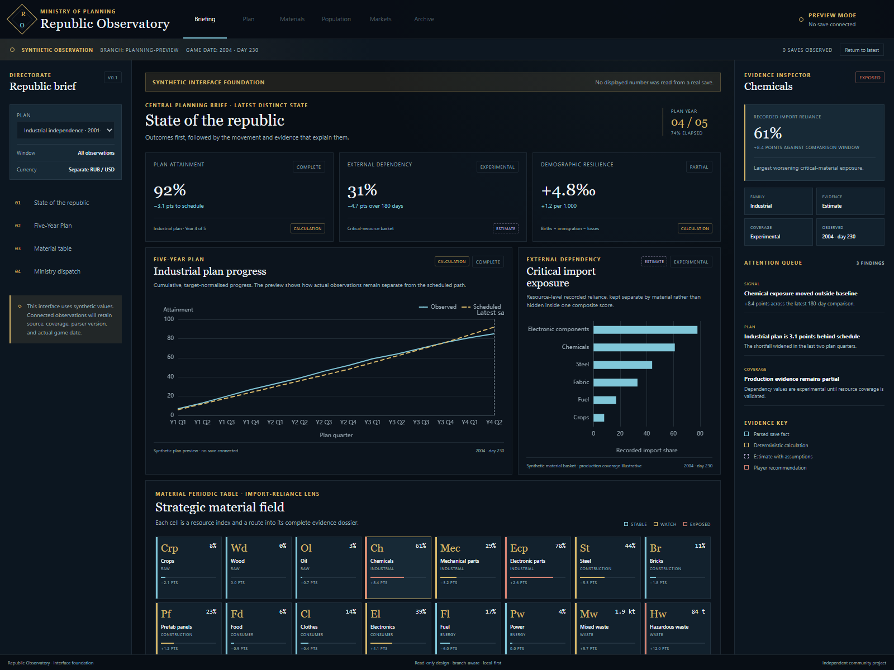

# Republic Observatory

**A local-first planning and statistical observatory for _Workers & Resources:
Soviet Republic_ saves.**

Republic Observatory watches newly created save archives, preserves their
branch-aware history, and turns the republic's statistics into explanations,
plans, experiments, and forecasts. It is intended to answer four recurring
questions:

1. What changed?
2. Is the change ordinary variation or a meaningful signal?
3. What probably contributed to it?
4. What happens if the player intervenes?

> **Project status:** product specification and interface foundation. The
> included Svelte application is a runnable synthetic-data preview; it does not
> yet scan or parse a real save.



## Proposed experience

- **Republic Briefing** — plan attainment, external dependency, demographic
  resilience, guardrails, and a concise save-to-save dispatch.
- **Five-Year Plan** — targets, actual-versus-plan progress, variance bridges,
  confidence ranges, milestones, and scenario testing.
- **Material Periodic Table** — every resource presented as a compact cell with
  trade, price, use, risk, and provenance context.
- **Industrial Laboratory** — production-chain diagrams, limiting-reagent
  analysis, theoretical yield, sensitivity, and optimisation.
- **Population and Welfare** — demographic decomposition, statistically useful
  control charts, and city comparison without hiding behind national averages.
- **Trade and Markets** — price indices, concentration, currency exposure,
  break-even analysis, market response, debt, and tourism yield.

The complete proposal is in the [project brief](docs/project-brief.md),
[analytical catalogue](docs/analytical-catalogue.md), and
[interface specification](docs/dashboard-and-interface.md).

## Interface foundation

The interface follows the methodology established by
[OnAir WyrmGrid](https://github.com/phobos-dthorga/onair-wyrmgrid):

- Svelte 5 and TypeScript;
- semantic theme tokens and a dense operational workspace;
- explicit live/historical and source states;
- provenance attached to every chart;
- Apache ECharts behind one declarative application-owned adapter; and
- a local-first, summary-to-diagnosis information hierarchy.

It is deliberately not a WyrmGrid reskin. The Observatory has its own visual
identity, resource vocabulary, navigation, statistical contracts, and game-save
architecture. See [ADR-0002](docs/architecture/decisions/0002-wyrmgrid-interface-methodology.md).

## Run the preview

Requires Node.js 22.12 or newer and npm 10 or newer.

```powershell
npm install
npm run dev
```

The preview contains synthetic values only. Validate the foundation with:

```powershell
npm run format:check
npm run check
npm test
npm run build
```

## Proposed technical foundation

| Area                          | Direction                                            |
| ----------------------------- | ---------------------------------------------------- |
| Desktop shell                 | Tauri 2 after the scanner vertical slice begins      |
| Save observation and services | Rust                                                 |
| Interface                     | Svelte 5 and TypeScript                              |
| Charts                        | Apache ECharts behind `ObservatoryChart`             |
| Local storage                 | SQLite with append-only migrations                   |
| Input                         | ZIP saves read non-destructively; `stats.ini` first  |
| Statistical models            | Application-owned, versioned and provenance-labelled |

The repository begins with the webview-compatible interface because that is the
smallest useful foundation. Rust, Tauri and SQLite are introduced with the
first real save-observation vertical slice, rather than as empty scaffolding.

## Documentation

- [Documentation index](docs/README.md)
- [Data sources and limitations](docs/data-sources-and-limitations.md)
- [Dependency decisions](docs/dependencies.md)
- [Metric definitions](docs/metric-definitions.md)
- [Architecture](docs/architecture/overview.md)
- [Roadmap](docs/roadmap.md)
- [Contributing](CONTRIBUTING.md)

## Independence and trademarks

Republic Observatory is an independent community project. It is not affiliated
with, endorsed by, or sponsored by 3Division or Hooded Horse. _Workers &
Resources: Soviet Republic_ and related names may be trademarks of their
respective owners. No game assets or save data are distributed by this project.

Source code and documentation are available under the [MIT License](LICENSE).
